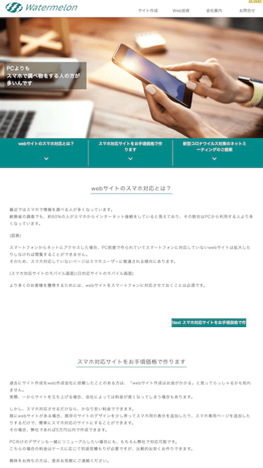
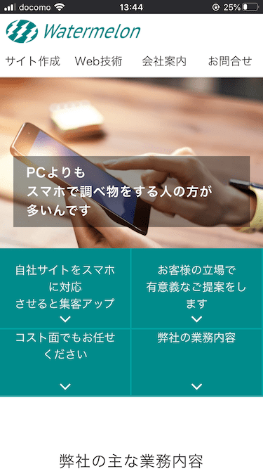

t::株式会社ウォーターメロン 宮崎のスマホ対応のWebサイト作成サービス

d::株式会社ウォーターメロンでは、スマートフォンに対応したWebサイトをお手頃な価格で作成致します。新規作成だけでなく、既存のWebサイトのスマホへの対応作業も承っております。宮崎県内で活動しておりますが、他県でもメールなどを利用してご依頼頂けます。

k::宮崎県 宮崎市 webサイト作成 スマホ対応

# 株式会社ウォーターメロン

<section class="mc_view top_page_top">
			

				

				

				
PCよりも スマホで調べ物をする人の方が 多いんです

			

				<!--top-page-top-sec-->
			

		</section>
		

## webサイトのスマホ対応とは？

%img_box1(l)%

%%%

最近ではスマホで情報を調べる人が多くなっています。
総務省の調査でも、約60%の人がスマホからインターネット接続をしていると答えており、その割合はPCから利用する人より多くなっています。

左の図はスマホ対応していないサイトとしているサイトをスマホから閲覧した際のイメージです。

スマートフォンからネットにアクセスした場合、PC前提で作られていてスマートフォンに対応していないwebサイトは**拡大したりしなければ閲覧することができません**。
そのため、スマホ対応していないページはスマホユーザーに敬遠される傾向にあります。

より多くのお客様を獲得するためには、webサイトをスマートフォンに対応させておくことは必須です。

## スマホ対応サイトをお手頃価格で!

過去にサイト作成をweb作成会社に依頼したことのある方は、「webサイト作成はお金がかかる」と思ってらっしゃるかも知れません。
実際、一からサイトを立ち上げる場合、会社によっては料金が高くなってしまう場合もあります。

しかし、スマホ対応させるだけなら、かなり安い料金でできます。
既にwebサイトがある場合、既存のサイトのデザインを少し弄ってスマホ用の表示を追加したり、スマホ専用ページを追加したりするだけで、簡単にスマホ対応のサイトにすることができます。
その場合、弊社であれば5万円以内で作成できます。

PC向けのデザインも一緒にリニューアルしたい場合にも、もちろん弊社で対応可能です。
こちらの場合の料金はケースに応じて別途見積もりが必要ですが、比較的お安くお作りできます。

興味をお持ちの方は、是非お気軽にご連絡ください。

## 新型コロナ対策のネットミーティングのご提案

弊社は宮崎市内に拠点を構えておりますので、基本的に宮崎県内であれば訪問して面談でのお打ち合わせを予定しております。

しかし、現在世界中で蔓延している新型コロナウイルス対策として、ミーティングアプリの「[zoom](https://zoom.us/)」を使用したオンラインでのお打ち合わせも可能です。
zoomを使用した場合、複数人でのミーティングや画面共有もできるので、一般的な打ち合わせと同じようなやり取りができます。

事前のアカウント作成なども不要で、こちらからお送りするURLにアクセスして頂くだけで、ミーティングを始められます。
お客様の方では料金もかかりません。

是非ご検討ください。
